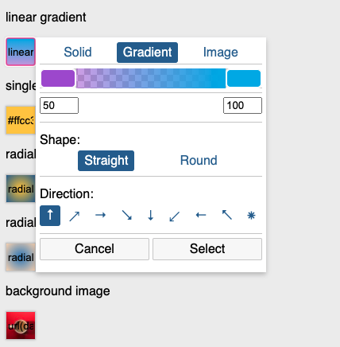

# cpicker
an extremely simple background colour/gradient/image picker

Replaces the element you initialise it on with an input type='text' whose value is set to the background property that represents the background colour you want to use. Also sets the colour style property to black or white depending on the best readable text colour for that background.

## limitations

* when using on an input field of any type, it will be changed to `type=text` so that it an support the return values.

* when using on a div, an input field will be added as a child of the div for the same purpose

* styles are dynamically injected. if you want to write your own styles use the `./src/cpicker.css` file as a reference and include the file to the document head using `id='cpicker'` on the link or style tag to prevent the injection of the stylesheet.

* gradients only have two stops, at 1% and 99%. better gradient pickers are available such as https://github.com/artf/grapick if you need better capabilities.

* background images only offer simple property setting and returns the value as a base64 encoded image

* if a selected colour contains alpha information (e.g. is not fully opaque) it is returned as a rgba quad, otherwise colours are returned in hex notation.

## usage

include the script to your page

``

Initialise the picker on a div or input element

    <input type='color' value='#ffcc33' class='cpicker'>
    

(in your script)

    [...document.querySelectorAll('.cpicker')].forEach(node => {
        let n = new CPicker(node, {
            callback: function(colour) {
                console.log(node, 'callback', colour);
            }
        })
    });

(or)

    let bg = new CPicker(document.getElementById('bgpicker'));

### developing

run `npm init` to set up depenencies.

run `npm start build` for a production and `npm start dev` for development (unminified)

## callback

The `callback` parameter is sent the value of the background style property you can use to apply the background colour. it may be similar to one of the following:

* linear-gradient(0deg, rgba(168,80,215,0.5) 1%, #24afeb 99%)
* #ffcc33
* rgba(255,204,51,0.95)
* radial-gradient(circle at center, #ffcc33 1%, #336699 99%)
* url(data:image/jpeg;base64,/9j/ ... //Z) repeat top left / cover

You could set your objects `background` css property to this value to apply the background.

## references

includes https://github.com/fanaiai/xncolorpicker/blob/main/src/xnquery.js through sheer laziness

## Licence

MIT

